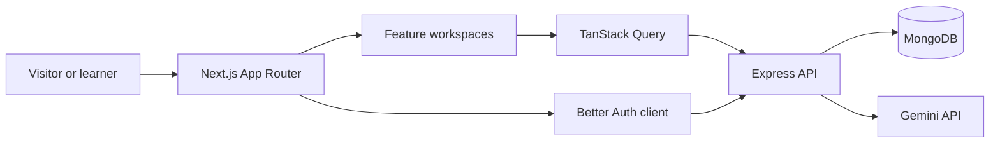

# SkillForge AI — Web Client

SkillForge AI is an AI-powered career planning and learning workspace for students, graduates, and self-directed learners. This repository contains the production-oriented Next.js client for personalized roadmaps, progress analytics, portfolio projects, interview practice, and a context-aware AI mentor.

> Backend repository: [SCIC-Assignment-05-Server](https://github.com/FBushra-git/SCIC-Assignment-05-Server)


## Product highlights

- Personalized career profiles with skills, goals, experience, study availability, and learning preferences
- Gemini-powered roadmap generation with progressive phases, weekly milestones, resources, projects, and interview checkpoints
- Persistent progress tracking, completion controls, learning streaks, and Recharts analytics
- Context-aware AI mentor with conversation history, Markdown, code blocks, and suggested prompts
- Public roadmap exploration with search, simultaneous filters, sorting, and pagination
- Project library with real imagery, saved status, dedicated details, and related recommendations
- Complete learner-owned item CRUD: public listing/details plus protected add, edit, manage, and delete flows
- Email/password, Google OAuth, and one-click demo authentication through Better Auth
- Responsive premium SaaS interface with light/dark themes, accessible navigation, loading states, error states, and honest empty states
- Database-backed newsletter, contact, and account-recovery request forms

## Technology

| Area | Technology |
| --- | --- |
| Framework | Next.js 16 App Router, React 19 |
| Language | TypeScript |
| Styling | Tailwind CSS 4, shadcn-style UI primitives, class-variance-authority |
| Server state | TanStack Query |
| Forms | React Hook Form and Zod |
| Visualization | Recharts |
| Animation | Framer Motion |
| Authentication | Better Auth client |
| Theme | next-themes |
| Icons | Lucide React |
| Fonts | Plus Jakarta Sans and Inter through Fontsource |

## Application architecture



The UI is organized by feature rather than by page alone. Route files stay small while domain components, queries, API clients, types, and validation live together under `src/features`.

## Main routes

### Public

| Route | Purpose |
| --- | --- |
| `/` | Landing page, live activity statistics, FAQ, and newsletter |
| `/roadmaps` | Search, filter, sort, and paginate public roadmaps |
| `/roadmaps/[slug]` | Public roadmap details and learning resources |
| `/resources` | Curated documentation, courses, tutorials, and practice resources |
| `/items` | Public learner-owned project item directory |
| `/items/[itemId]` | Public project item details and related items |
| `/blog` and `/blog/[slug]` | Original learning and career articles |
| `/about`, `/careers`, `/contact`, `/help` | Company and support information |
| `/privacy`, `/terms` | Project-specific legal information |
| `/login`, `/register`, `/forgot-password` | Authentication and recovery entry points |

### Authenticated

| Route | Purpose |
| --- | --- |
| `/dashboard` | Personalized overview, quick actions, suggestions, activity, and analytics |
| `/profile` | Profile, career goal, skills, preferences, theme, and account controls |
| `/roadmaps/new` | Gemini-powered personalized roadmap generator |
| `/my-roadmaps` | Saved roadmaps and progress |
| `/my-roadmaps/[roadmapId]` | Expandable timeline and lesson completion |
| `/my-projects` | Practical portfolio project library and saved status |
| `/projects/[slug]` | Project objectives, features, outcomes, and progress controls |
| `/mentor` | Context-aware AI mentor conversation workspace |
| `/interview` | AI question generation, sessions, bookmarks, and completion tracking |
| `/items/add` | Create a public project brief |
| `/items/manage` | Search, edit, inspect, and delete owned project items |
| `/items/[itemId]/edit` | Ownership-protected item editor |

## Getting started

### Prerequisites

- Node.js 20 or newer
- npm
- A running copy of the [SkillForge AI server](https://github.com/FBushra-git/SCIC-Assignment-05-Server)

### Installation

```bash
git clone https://github.com/FBushra-git/SCIC-Assignment-05-Client.git
cd SCIC-Assignment-05-Client
npm install
```

Create the local environment file:

```bash
cp .env.example .env.local
```

On PowerShell:

```powershell
Copy-Item .env.example .env.local
```

Configure the API origin:

```env
NEXT_PUBLIC_API_URL=http://localhost:5000
```

Start development:

```bash
npm run dev
```

Open [http://localhost:3000](http://localhost:3000).

## Available commands

| Command | Description |
| --- | --- |
| `npm run dev` | Start the Next.js development server |
| `npm run build` | Create and type-check the optimized production build |
| `npm start` | Serve the production build |
| `npm run lint` | Run ESLint across the client |

## Project structure

```text
src/
├── app/                 # App Router pages, layouts, and global styles
├── components/
│   ├── content/         # Reusable public content layouts
│   ├── layout/          # Header, footer, and brand
│   ├── providers/       # Query and theme providers
│   ├── shared/          # Shared page-level UI
│   └── ui/              # Reusable UI primitives
├── content/             # Curated static editorial content
├── features/
│   ├── auth/            # Login, registration, Google, and demo auth
│   ├── dashboard/       # Live widgets and Recharts analytics
│   ├── explore/         # Public roadmaps and resources
│   ├── interview/       # AI interview practice
│   ├── item/            # Complete public/protected item CRUD
│   ├── landing/         # Landing page sections
│   ├── mentor/          # Context-aware AI chat
│   ├── platform/        # Statistics, newsletter, and contact APIs
│   ├── profile/         # Personalization and account settings
│   ├── project/         # Portfolio project library
│   └── roadmap/         # Generation, timelines, and progress
└── lib/                 # Shared request and utility helpers
```

## Authentication notes

- Authentication cookies are sent with API requests using `credentials: "include"`.
- Google OAuth is configured on the server; the client does not contain Google secrets.
- Demo Login provisions the demonstration identity on first use and then opens the dashboard.
- Protected workspaces redirect unauthenticated visitors to `/login`.

## Quality and accessibility

- Semantic headings, labeled controls, focus-visible states, and a skip link
- Responsive navigation that becomes a touch-friendly menu on smaller screens
- Reduced-motion awareness for animated statistics
- Dedicated loading, empty, success, and error states
- Meaningful image alternative text and consistent card dimensions
- Client validation mirrored by server-side Zod validation

Before publishing a change, run:

```bash
npm run lint
npm run build
```

## Deployment

The client is ready for Vercel or another Next.js-compatible Node host.

1. Import this repository into the hosting platform.
2. Set `NEXT_PUBLIC_API_URL` to the public HTTPS origin of the deployed server.
3. Deploy the server first so authentication callbacks and API requests have a stable origin.
4. Add the final client URL to the server's `CLIENT_URL` trusted-origin configuration.

## License

Built for SCIC Assignment 05. Review the repository license and assignment terms before reuse.
